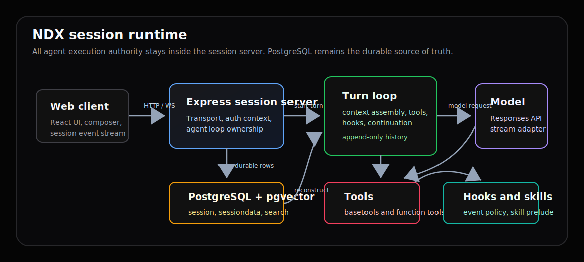

# 전체 구조

NDX는 TypeScript + Turbo monorepo다. 하나의 deployable app인 `apps/ndx`가 Express 서버, webclient, settings surface, documents site, Docker 런타임을 제공하고, product domain은 `packages/ndx`가 소유한다.

## 최상위 구성

| 경로 | 역할 |
| --- | --- |
| `apps/ndx` | 배포 가능한 Express 서비스와 React UI composition. |
| `packages/ndx` | agent, webclient, common domain contracts. |
| `pgvector` | Korean text search 지원 pgvector base image 소스. |
| `npm` | 최종 사용자용 Docker launcher 패키지. |
| `docs` | durable product/runtime/operator 문서. |
| `.codex/skills` | repo-local 작업 절차와 검증 가이드. |

## 앱 표면

| 표면 | 구현 |
| --- | --- |
| Web client | `apps/ndx/src/webclient_front` |
| Settings client | `apps/ndx/src/webclient_front/settings` |
| Documents client | `apps/ndx/src/documents_front` |
| Express server | `apps/ndx/src/server` |
| Session socket wiring | `apps/ndx/src/server/agent` |
| Webclient HTTP API | `apps/ndx/src/server/web/webclient` |
| Settings HTTP API | `apps/ndx/src/server/web/webclient/settings` |
| Docker runtime | `apps/ndx/docker` |

## 패키지 표면

| export | 구현 |
| --- | --- |
| `ndx/common` | protocol, resource, log, response API, server path. |
| `ndx/agent/*` | account, project, session, turnloop, tools, hooks, context subpaths. |
| `ndx/webclient/common` | webclient DTO와 protocol. |
| `ndx/webclient/front` | browser-facing domain helper. |
| `ndx/webclient/server` | settings/model/client-state persistence helper. |

## 설계 이유

NDX는 UI가 많은 앱처럼 보이지만 핵심 제품은 session runtime이다. 그래서 domain invariant를 React나 Express route 안에 넣지 않는다. 앱은 framework lifecycle과 transport만 담당하고, session truth와 agent execution은 package domain에 둔다.

이 구조는 다음 문제를 줄인다.

| 문제 | 방지 방식 |
| --- | --- |
| 웹 클라이언트가 agent loop를 소유함 | `apps/ndx/src/webclient_front`는 `ndx/agent/*`를 import하지 않는다. |
| socket transport가 state machine이 됨 | socket server는 protocol event fan-out만 맡는다. |
| DB와 memory state가 충돌함 | PostgreSQL row를 권위 상태로 둔다. |
| 문서가 코드와 어긋남 | 문서 사이트가 source map과 audit plan을 포함한다. |

## 빌드와 서빙

Vite는 webclient를 `apps/ndx/dist/webclient_front`로, documents site를 `apps/ndx/dist/documents_front`로 빌드한다. Express는 production에서 webclient를 루트 경로로 제공하고 `/docs`는 별도 문서 번들을 제공한다. Settings는 webclient 안의 surface이며 HTTP route는 orchestration만 담당한다.
